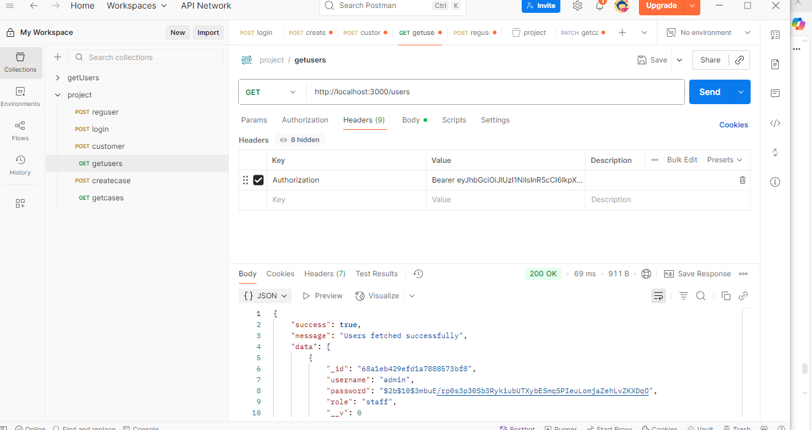
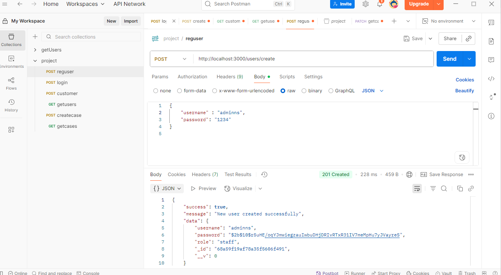
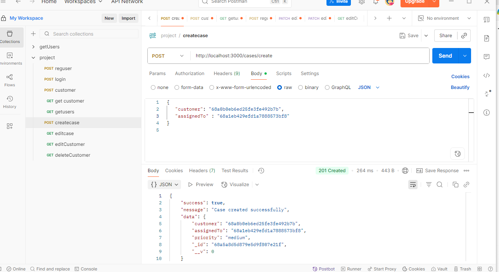
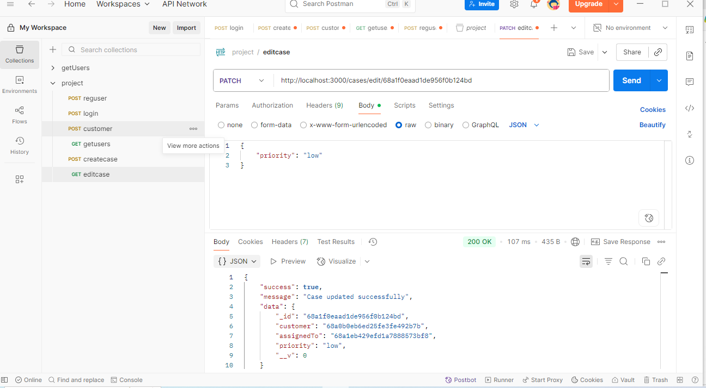
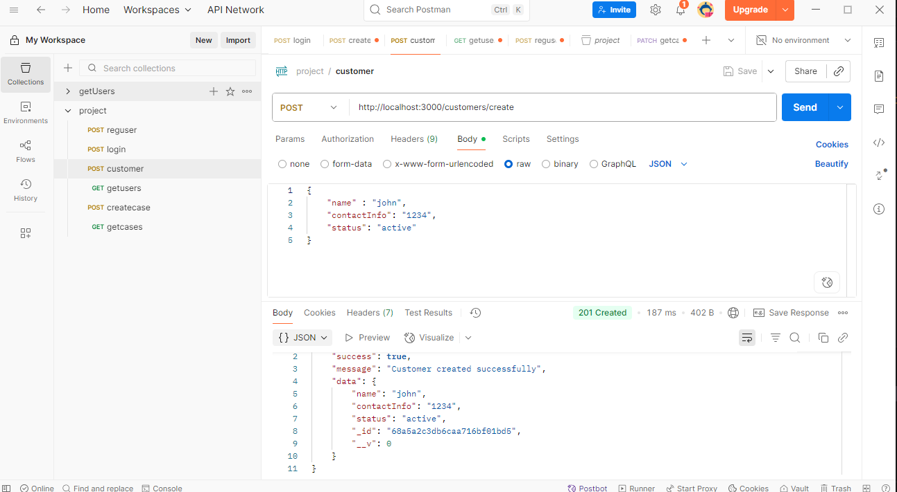
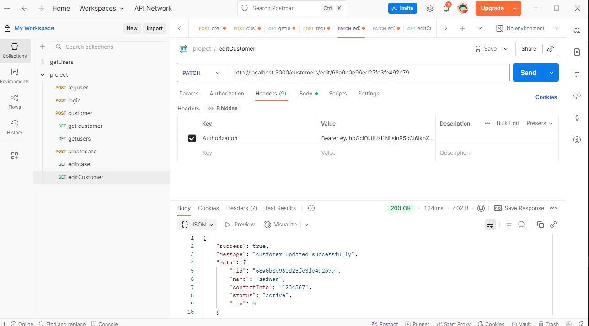
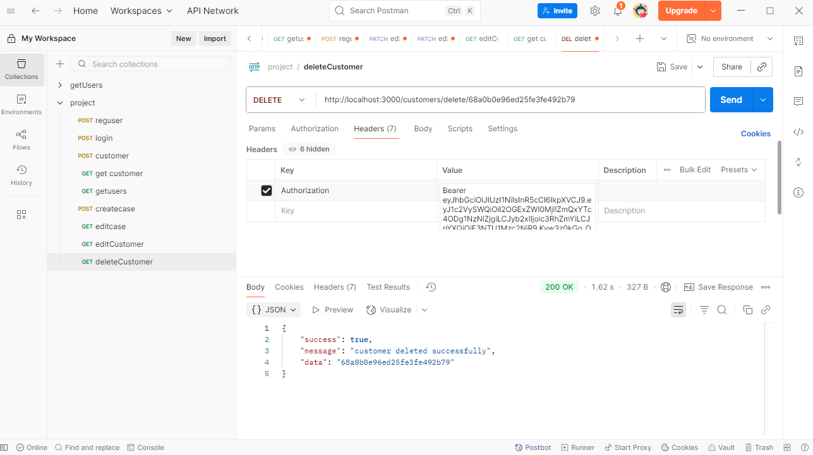

# 📌 Customer Relationship Management (CRM) Backend

This project is a **backend system** for a Customer Relationship
Management (CRM) application.\
It is built using **Node.js, Express, MongoDB, and JWT authentication**.

The backend handles **user management (admin/staff), customer management
(CRUD), and case management**.

------------------------------------------------------------------------

## 🚀 Features

-   **User Management**
    -   Admin can create new users (staff).
    -   Staff can login with username/password.
    -   JWT-based authentication & role-based access.
-   **Customer Management (CRUD)**
    -   Create, Read, Update, Delete customer records.
-   **Case Management**
    -   Staff can create and edit cases assigned to customers.
    -   Cases reference both customer and staff.
-   **Role-based Access Control**
    -   Admin → Manage users.\
    -   Staff → Manage customers & cases.

------------------------------------------------------------------------

## 🛠️ Tech Stack

-   **Backend Framework**: Express.js\
-   **Database**: MongoDB (Mongoose ODM)\
-   **Authentication**: JWT + bcrypt for password hashing\
-   **Version Control**: Git / GitHub

------------------------------------------------------------------------

## 📂 Project Structure

    crm-backend/
    │── controllers/       # Business logic
    │── middlewares/       # Auth, role checks
    │── models/            # Mongoose schemas
    │── routes/            # API routes
    │── server.js          # Entry point
    │── .env               # Environment variables

------------------------------------------------------------------------

## ⚙️ Setup Instructions

### 1️⃣ Clone Repository

``` bash
git clone https://github.com/yourusername/crm-backend.git
cd crm-backend
```

### 2️⃣ Install Dependencies

``` bash
npm install
```

### 3️⃣ Setup Environment Variables

Create a `.env` file:

    MONGO_URI=your_mongodb_connection_string
    SECRET=your_jwt_secret
    PORT=3000

### 4️⃣ Start Server

``` bash
npm start
```

Server will run at: `http://localhost:3000`

------------------------------------------------------------------------

## 🔑 API Endpoints

### 👤 User Routes

  Method   Endpoint          Role     Description
  -------- ----------------- -------- --------------------------
  POST     `/users/login`    Public   Login user (returns JWT)
  POST     `/users/create`   Admin    Create new user (staff)
  GET      `/users/`         Admin    Get all users

📷 *Screenshot: Example Postman login request/response here*

------------------------------------------------------------------------

### 👥 Customer Routes

  Method   Endpoint              Role    Description
  -------- --------------------- ------- ---------------------
  GET      `/customers/`         Staff   Get all customers
  POST     `/customers/create`   Staff   Create new customer
  PATCH    `/customers/:id`      Staff   Update customer
  DELETE   `/customers/:id`      Staff   Delete customer

📷 *Screenshot: Example Create Customer request/response here*

------------------------------------------------------------------------

### 📂 Case Routes

  Method   Endpoint            Role    Description
  -------- ------------------- ------- -----------------
  POST     `/cases/create`     Staff   Create new case
  PATCH    `/cases/edit/:id`   Staff   Update case
  GET      `/cases/`           Staff   Get all cases

📷 *Screenshot: Example Create Case request/response here*

------------------------------------------------------------------------

## 🔒 Authentication Flow

1.  User logs in → receives JWT token.\

2.  Token is sent in request headers:

        Authorization: Bearer <token>

3.  Middleware verifies token → grants access based on role.

📷 *Screenshot: JWT token response from login*

------------------------------------------------------------------------

## 🗂️ Example Request Bodies

### 🔹 Create User

``` json
{
  "username": "staff1",
  "password": "securepass"
}
```

### 🔹 Create Customer

``` json
{
  "name": "John Doe",
  "contactInfo": "john.doe@gmail.com",
  "status": "active"
}
```

### 🔹 Create Case

``` json
{
  "customer": "64abf9e8c23e2b5b90d3e9c7",
  "assignedTo": "64abf9e8c23e2b5b90d3e9a2",
  "priority": "high"
}
```










------------------------------------------------------------------------

## 🧪 Testing

-   Use **Postman** for testing APIs.\
-   Use your JWT token in the `Authorization` header for protected
    routes.

------------------------------------------------------------------------

